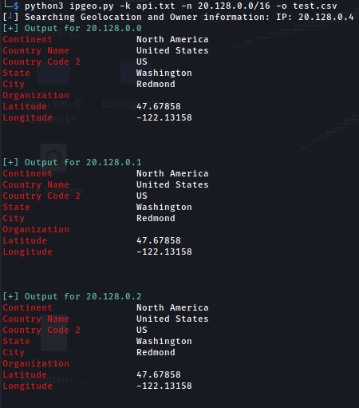
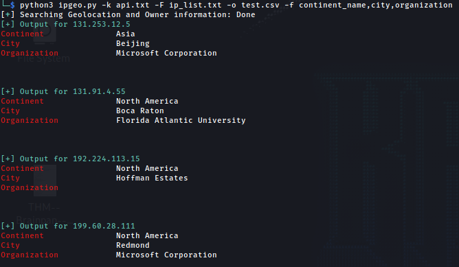

# README for Ipgeo

## A python program for returning the geolocation and owner of an IP Address/list of IP Addresses/CIDR

** This program requires an API key from https://ipgeolocation.io/, accounts are free

Usage:
```sh
pip3 install -r requirements.txt
python3 ipgeo.py -h
```


```sh
python3 ipgeo.py --help
Usage: ipgeo.py [options]

Options:
  -h, --help            show this help message and exit
  -i IP_ADDR, --ip_addr=IP_ADDR
                        IP Address to search for
  -f FIELDS, --fields=FIELDS
                        fields to search for, enter a comma seperated list:
                        field,field1,field2
  --lf, --list_fields   list all the possible fields
  -a API_KEY, --api_key=API_KEY
                        Enter your API key
  -F FILE_LIST, --file_list=FILE_LIST
                        Enter your API key
  -n CIDR_NOTATION, --cidr_notation=CIDR_NOTATION
                        Enter an IP Address range using CIDR ex:
                        192.168.1.0/24
  -o OUTPUT_FILE, --output_file=OUTPUT_FILE
                        File name for the csv output, default is
                        whodis_lookup.csv
  -H, --hide_output     Hide the output

```


Possible search field list:
```sh
python3 ipgeo.py --lf
continent_name
country_code2
country_code3
country_name
country_capital
state_prov
district
city
zipcode
latitude
longitude
is_eu
calling_code
country_tld
languages
country_flag
isp
connection_type
organization
geoname_id
```

Example commands:
```sh
python3 ipgeo.py -a APIKEYHERE -n 192.168.1.0/24 
python3 ipgeo.py -k api.txt -F ip_list.txt -o file.csv
python3 ipgeo.py -k api.txt -i 192.168.1.1 -o output.csv
```


Example Outputs:






