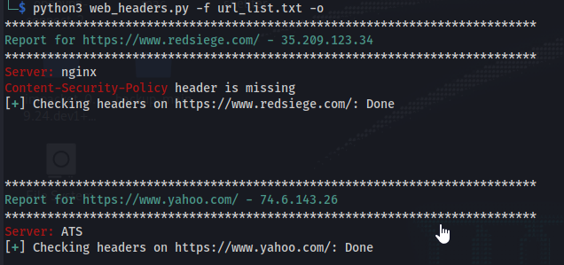
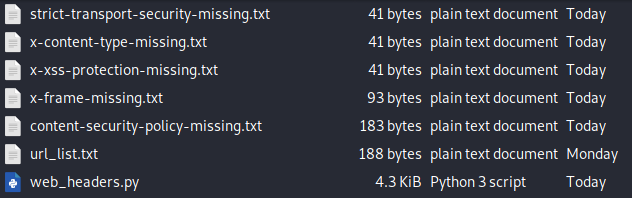
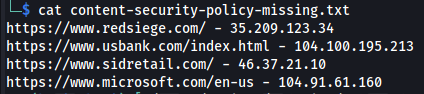

# README for web_headers.py

## A python program for analyzing web responses for missing headers

This program can take a list of URLs from a file(one per line) or a single URL as input.

Usage:
```sh
pip3 install -r requirements.txt
python3 web_headers.py -h
```

Example commands:
```sh
python3 web_headers.py -f list.txt
python3 web_headers.py -u https://www.google.com 
```


```sh
┌──(kali㉿kali)-[~/tools/scripts/RedSeige/web_headers/Web_Headers]
└─$ python3 web_headers.py -h
Usage: web_headers.py [options]

Options:
  -h, --help            show this help message and exit
  -f FILE_LIST, --file_list=FILE_LIST
                        File with a list of URLs
  -u URL, --url=URL     Enter a single URL
  -o, --output          Enter the name of the Folder for the output to be
                        stored. Files are created for each missing Header and
                        IPs are added to each respective file.

```

Example Output:




Using -o creates a txt file for each missing header found during the scan.




Within each file is a list, one URL - IP per line, if the URL appears in a list it is missing the appropriate header.


